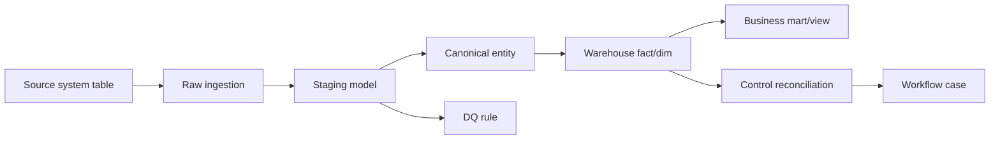

# Output Templates

Use these structures for user-facing output. Keep outputs concise unless the user asks for exhaustive artifacts.

## Contents

- Architecture Brief
- Approval Proposal
- Complete Local SQLite Ecosystem Package
- Delegation Plan
- Application Catalog Columns
- Schema Catalog Columns
- Table Definition Template
- Dataflow Template
- Control Rule Template
- Data Quality Rule Template
- Mermaid Dataflow Pattern
- Synthetic Data Plan Template

## Architecture Brief

```text
1. Organization archetype
2. Fictional organization name
3. Assumptions
4. Business domains
5. Application landscape
6. Data architecture layers
7. Critical dataflows
8. Controls and reconciliation
9. Data quality and exception handling
10. Security, privacy, audit, workflow, documents
11. Mock data generation plan
12. Realism risks and edge cases
13. Recommended next artifact or build package
```

## Approval Proposal

Use before creating files, overwriting a database, or generating large synthetic data.

```text
Proposed package:
- Organization archetype:
- Fictional organization name:
- Target platform:
- Scale profile:
- Time horizon:
- Artifacts:
- Optional dashboard:
- Expected runtime / file size:
- Validation plan:
- Destructive operations:

Approve this build?
```

## Complete Local SQLite Ecosystem Package

Use when the user wants a local, portable, populated ecosystem.

```text
1. Discovery assumptions
2. Approved package
3. Folder structure
4. SQLite DDL files
5. SQL flow files or views
6. Deterministic data generator
7. Populated database path
8. Validation scripts
9. Validation report
10. Profile summary
11. Optional dashboard
12. Run commands
13. Known controlled imperfections
14. Recommended next iterations
```

## Delegation Plan

Use when parallel workers/subagents/background tasks are available.

```text
Main agent responsibilities:
- user approval
- artifact plan
- integration
- destructive operations
- final validation
- final summary

Worker assignments:
- Ecosystem Architect:
- SQLite Schema Builder:
- Data Generator:
- Validation Reviewer:
- Dashboard Builder:

Conflict rules:
- naming convention:
- write scopes:
- integration order:
- validation gate:
```

## Application Catalog Columns

```text
application_id
application_name
application_type
business_owner
technical_owner
system_of_record_domain
hosting_model
criticality
contains_pii_flag
contains_phi_flag
contains_pci_flag
contains_financial_data_flag
active_flag
integrates_with
```

## Schema Catalog Columns

```text
schema_name
table_name
layer
business_domain
purpose
grain
primary_key
foreign_keys
source_system
owner
sensitivity
expected_row_count
history_type
```

## Table Definition Template

```text
Table:
Layer:
Domain:
Purpose:
Grain:
Primary key:
Foreign keys:
Natural/business keys:
Key columns:
Effective dating:
Audit/source fields:
Sensitivity:
Known caveats:
```

## Dataflow Template

```text
Name:
Business purpose:
Trigger:
Systems:
Sequence:
Source-to-canonical mappings:
Warehouse/mart outputs:
Controls:
DQ checks:
Expected exceptions:
Latency/as-of behavior:
```

## Control Rule Template

```text
rule_id:
rule_name:
source_dataset:
target_dataset:
grain:
measure:
tolerance:
frequency:
owner:
severity:
expected_break_rate:
break_workflow_queue:
```

## Data Quality Rule Template

```text
rule_id:
rule_name:
dataset:
column_or_relationship:
rule_type:
condition:
severity:
frequency:
expected_failure_rate:
owner:
remediation_workflow:
```

## Mermaid Dataflow Pattern



## Synthetic Data Plan Template

```text
Time horizon:
Entity volumes:
Generation order:
Distributions:
State machines:
Roll-forward rules:
Controlled imperfections:
Late-arriving/restatement scenarios:
Validation SQL/tests:
Expected reconciliation breaks:
Privacy safeguards:
```
